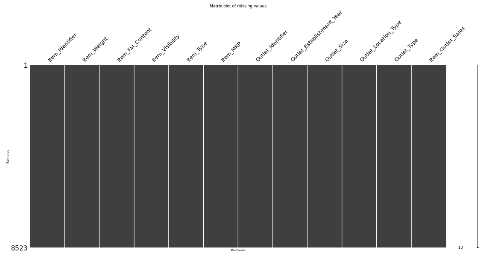
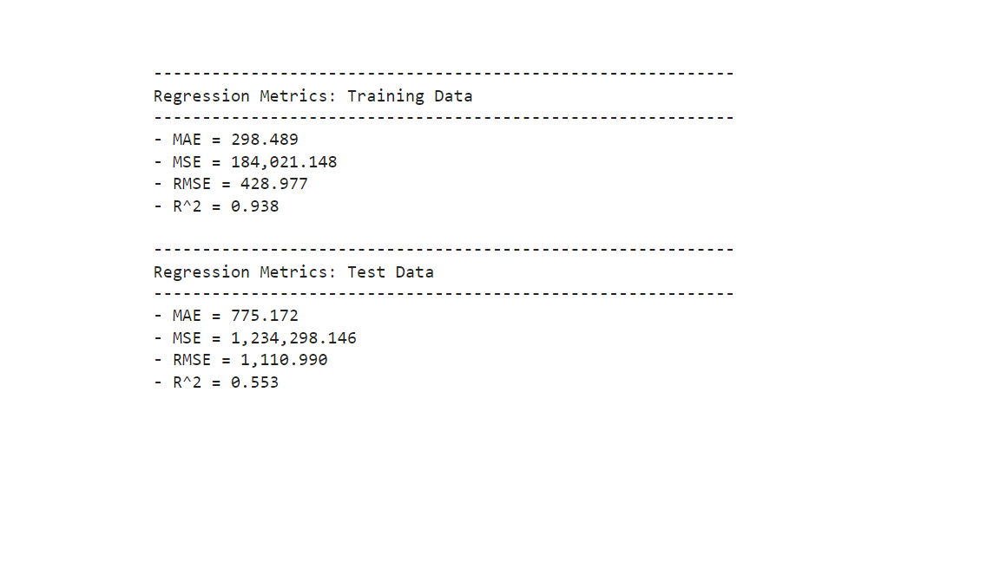

# Title that recommends an action
## Subtitle describing the analysis 

**Author**: Malek lachheb

### Business problem:

Our main problem is to predict item outlet sale 

### Data:
Our data is composed of 11 column including 	Item_Identifier	Item_Weight	Item_Fat_Content	Item_Visibility	Item_Type	Item_MRP	Outlet_Identifier	Outlet_Establishment_Year	Outlet_Size	Outlet_Location_Type	Outlet_Type	Item_Outlet_Sales 

## Methods
- For data preparation we start 
cleaning data by taking care of missing value 
then we took a look on any inconstanciy related to catagorical information finally we eliminate all the duplication 
- 

## Results
- For data preparation we start 
cleaning data by taking care of missing value 
then we took a look on any inconstanciy related to catagorical information finally we eliminate all the duplication 
- 

### Here are examples of how to embed images from your sub-folder

#### Data representation

> here we can see how all columns are well traited 

#### performes Metrics result 

> we tested the model using random forest where the model shows a noticebale underfit 

### For further information

For any additional questions, please contact **lachheb0malek123@gmail.com**
